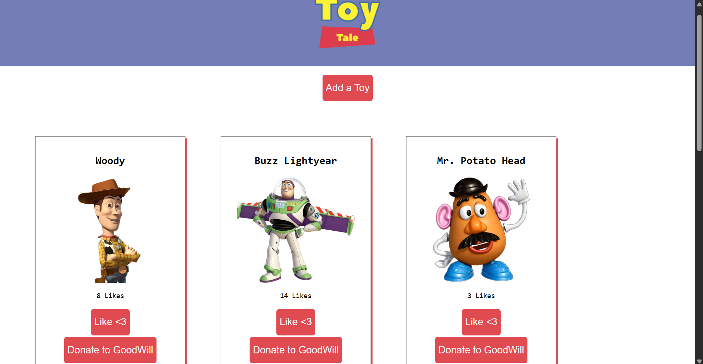

# Toy Tales

A React application that allows users to view and manage Andy's toy collection.

## Setup

All the information about Andy's toys can be found in the `db.json` file. We'll
be using `json-server` to create a RESTful API for our database.

Run `npm install` to install the dependencies.

Then, run `npm run server` to start up `json-server` on
`http://localhost:3001`.

In another terminal tab, run `npm run dev` to start up the React app.

In another terminal tab, run `npm run test` to run the test suite.

## Functionality

- When the application loads, it makes a GET request to `/toys` and displays
  all of the toys as `ToyCard` components.

- When the `ToyForm` is submitted, it makes a POST request to `/toys` to create
  a new toy. New toys start with 0 likes and are displayed in the collection.

- When the `Donate to GoodWill` button is clicked, it makes a DELETE request to
  `/toys/:id` and removes the donated toy from the collection.

- When the Like button is clicked, it makes a PATCH request to `/toys/:id` with
  the toy's updated number of likes. The updated toy is displayed without
  changing the order of the collection.

## Tests

The application includes tests for:

- Displaying all toys
- Adding a toy
- Donating a toy
- Liking a toy

All tests are passing.

## Screenshot

